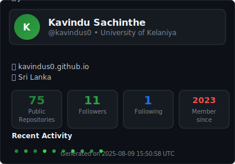

  

 

  

 

## 👨‍💻 About Me

- 🎓 Computer Science Student passionate about building useful things
- 🤖 AI/ML: FastAI, Scikit‑learn, TensorFlow, EDA
- 🌐 Full‑Stack: Next.js, FastAPI, Firebase, Supabase
- 📱 Flutter for mobile apps
- 🔌 Electronics: Logic circuits and IC projects
- 🌱 Currently learning Golang
- 💬 Ask me about AI, Web Dev, Flutter, or Cinema
- ⚡ Fun fact: Great cinema inspires great code

  

## 🛠️ Tech Stack

### 💻 Languages

### 🚀 Frameworks & Libraries

### 🗄️ Databases & Cloud

### 🔧 Tools & Platforms

  

## 🎬 Cinema That Codes My Soul

  

  
🌟 Mohanlal — <i>The Legend</i>

  
  - 🕵️‍♂️ Drishyam (I & II) — <i>Flawless suspense</i>
  - ⚡ Lucifer — <i>Mass meets mind</i>
  - 🔨 Spadikam — <i>Cult classic brilliance</i>

  
🎭 Fahadh Faasil — <i>The Actor's Actor</i>

  
  - 📷 Maheshinte Prathikaaram — <i>Revenge with grace</i>
  - 🧠 Joji — <i>A Macbeth-like thriller</i>
  - 🏠 Kumbalangi Nights — <i>A dysfunctional masterpiece</i>

  
🔥 Suriya — <i>Soul & Substance</i>

  
  - ✈️ Soorarai Pottru — <i>Sky is never the limit</i>
  - 🕰️ 24 — <i>Time-travel done right</i>
  - ⚖️ Jai Bhim — <i>Voice for the voiceless</i>

  

## 📊 Analytics, Animations & Dynamic Widgets

<!-- GitHub Stats -->
<picture>
  <source srcset="https://github-readme-stats.vercel.app/api?username=kavindus0&show_icons=true&theme=tokyonight&hide_border=true&bg_color=0D1117&title_color=00BFFF&icon_color=00BFFF&text_color=ffffff" media="(prefers-color-scheme: dark)" />
  <source srcset="https://github-readme-stats.vercel.app/api?username=kavindus0&show_icons=true&theme=default&hide_border=true&bg_color=ffffff&title_color=0366d6&icon_color=0366d6&text_color=24292e" media="(prefers-color-scheme: light), (prefers-color-scheme: no-preference)" />
  
</picture>

<!-- Streak -->
<picture>
  <source srcset="https://github-readme-streak-stats.herokuapp.com?user=kavindus0&theme=tokyonight&hide_border=true&background=0D1117&stroke=00BFFF&ring=00BFFF&fire=FF6B6B&currStreakLabel=00BFFF" media="(prefers-color-scheme: dark)" />
  <source srcset="https://github-readme-streak-stats.herokuapp.com?user=kavindus0&theme=default&hide_border=true&background=ffffff&stroke=0366d6&ring=0366d6&fire=FF6B6B&currStreakLabel=0366d6" media="(prefers-color-scheme: light), (prefers-color-scheme: no-preference)" />
  
</picture>

<!-- Top Languages -->
<picture>
  <source srcset="https://github-readme-stats.vercel.app/api/top-langs/?username=kavindus0&layout=compact&theme=tokyonight&hide_border=true&bg_color=0D1117&title_color=00BFFF&text_color=ffffff" media="(prefers-color-scheme: dark)" />
  <source srcset="https://github-readme-stats.vercel.app/api/top-langs/?username=kavindus0&layout=compact&theme=default&hide_border=true&bg_color=ffffff&title_color=0366d6&text_color=24292e" media="(prefers-color-scheme: light), (prefers-color-scheme: no-preference)" />
  
</picture>

<!-- Activity Graph -->
<picture>
  <source srcset="https://github-readme-activity-graph.vercel.app/graph?username=kavindus0&theme=tokyo-night&hide_border=true&bg_color=0D1117&color=00BFFF&line=00BFFF&point=FF6B6B" media="(prefers-color-scheme: dark)" />
  <source srcset="https://github-readme-activity-graph.vercel.app/graph?username=kavindus0&theme=github-compact&hide_border=true&bg_color=ffffff&color=0366d6&line=0366d6&point=FF6B6B" media="(prefers-color-scheme: light), (prefers-color-scheme: no-preference)" />
  
</picture>

<!-- Animated Metrics (requires workflow) -->

<!-- Contribution Snake (requires workflow) -->
<picture>
  <source media="(prefers-color-scheme: dark)" srcset="./assets/github-snake-dark.svg" />
  <source media="(prefers-color-scheme: light), (prefers-color-scheme: no-preference)" srcset="./assets/github-snake.svg" />
  
</picture>

<!-- Trophies -->
<picture>
  <source srcset="https://github-profile-trophy.vercel.app/?username=kavindus0&theme=tokyonight&no-frame=true&no-bg=true&margin-w=4&row=1" media="(prefers-color-scheme: dark)" />
  <source srcset="https://github-profile-trophy.vercel.app/?username=kavindus0&theme=flat&no-frame=true&no-bg=true&margin-w=4&row=1" media="(prefers-color-scheme: light), (prefers-color-scheme: no-preference)" />
  
</picture>

  

## 🤝 Connect With Me

  
### 💭 Quote to Code By

 

  
  
Crafted with ❤️ and lots of ☕ (just a Rs.10/= plain tea from UOK Gym Canteen)

<!--
Setup notes (optional, for animations):
1) Contribution Snake:
   - This README expects ./assets/github-snake.svg and ./assets/github-snake-dark.svg to exist.
   - Add the provided GitHub Action: .github/workflows/snake.yml

2) Metrics:
   - This README expects ./metrics.svg to exist.
   - Add the provided GitHub Action: .github/workflows/metrics.yml
   - Create a classic PAT with scopes: public_repo, read:user, read:org and save as repo secret METRICS_TOKEN.
-->
